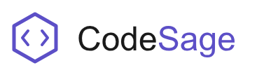

# CodeSage 🧙

> AI-powered code analysis and tutoring platform that helps beginner programmers debug, understand, and improve their code through personalized feedback and learning insights.

<p align="center">
    
</p>

## What is CodeSage?

CodeSage is a web platform designed for students learning to code. Unlike generic AI debuggers, CodeSage acts as a **personal tutor** — it doesn't just fix your code, it explains *why* something went wrong, adapts its language to your level, and tracks your mistakes over time to build a personalised weakness report.

---

## Why CodeSage? — Our USPs

### 🧠 1. Learning Path Intelligence *(Core USP)*
Most debuggers give you a one-shot fix and forget you exist. CodeSage tracks your errors **across every session** and builds a personalised weakness report — identifying your top recurring mistake patterns (e.g. "loop logic", "null handling", "variable scoping") and recommending targeted exercises to fix them. No other student-focused tool does longitudinal mistake tracking like this.

### 🎓 2. Beginner-First Explanations
Every error is explained at **your level**, not a senior developer's. Toggle between Beginner and Intermediate mode. Beginner mode uses plain English and analogies — *"Your loop never stops because there's no exit condition — think of a song on repeat with no stop button."* Jargon only appears when you're ready for it.

### 📈 3. Progress Tracking Over Time
CodeSage stores your full upload history and plots your improvement over time. Watch your error count drop week over week. Your dashboard becomes a mirror of your growth as a programmer.

### 🏫 4. Classroom Mode *(v3.0)*
Built with teachers in mind. Instructors get a dedicated dashboard showing class-wide error trends, individual student progress, and the ability to assign exercises based on common class mistakes — turning CodeSage into a full teaching assistant.

---

## Sitemap

```
CodeSage
│
├── Home
│   ├── Hero + CTA
│   ├── How it works (3 steps)
│   └── Social proof / Testimonials
│
├── Analyze             ← Core tool
│   ├── Code input (paste / upload)
│   ├── Language selector (auto-detect)
│   ├── Beginner / Intermediate toggle
│   └── Output tabs
│       ├── Errors (line references)
│       ├── Suggestions (best practices)
│       ├── Explanation (plain English)
│       └── Fixed code (diff view)
│
├── Dashboard           ← Requires login
│   ├── Upload history (timestamped)
│   ├── Progress chart (errors over time)
│   ├── Weakness report (top mistake categories)
│   └── Badges & streaks
│
├── Learn               ← Requires login (Pro)
│   ├── Auto-generated exercises
│   ├── Curated articles per error type
│   └── Mini coding challenges
│
├── Pricing
│   ├── Free tier
│   ├── Pro tier
│   └── Classroom plan
│
├── Help
│   ├── FAQs
│   └── Docs
│
└── Auth (Login / Sign up)
    └── Onboarding flow
        ├── Language picker
        └── Skill level selector
```

---

## Features

- **Error detection** — line-by-line bug detection across all major languages
- **Beginner-friendly explanations** — toggle between Beginner and Intermediate modes
- **Improvement suggestions** — best practices, cleaner patterns, idiomatic code
- **Fixed code view** — corrected snippet with diffs highlighted
- **Upload history** — every submission saved; revisit past feedback anytime
- **Learning Path Intelligence** *(Pro)* — recurring mistake tracking + personalised weakness report
- **Multi-language support** — Python, JavaScript, Java, C++, TypeScript, Go, Rust, and more

---

## Tech Stack

| Layer | Technology | Notes |
|---|---|---|
| Frontend | React + Vanilla CSS | Vite for build tooling |
| Backend | Python (Native `http.server`) | Zero-dependency REST API |
| Storage | In-Memory Dynamic Cache | Simple, lightweight submission history |
| Analysis | Heuristics Engine | Diagnoses programming errors instantly |

---

## AI API — Google Gemini 2.5 Flash (Free Tier)

After evaluating all major free AI APIs, **Google Gemini 2.5 Flash** is the recommended choice for CodeSage.

### Why Gemini?

| API | Free Tier | Code Quality | Python SDK | Verdict |
|---|---|---|---|---|
| **Gemini 2.5 Flash** | 60 req/min, no credit card | ⭐⭐⭐⭐⭐ | ✅ Official | ✅ **Best pick** |
| Groq (Llama 4) | ~6,000 req/day | ⭐⭐⭐⭐ | ✅ | Fast but weaker reasoning |
| OpenAI GPT-4o | $5 credit only | ⭐⭐⭐⭐⭐ | ✅ | Not truly free |
| Mistral Large 2 | 5 RPM only | ⭐⭐⭐⭐ | ✅ | Too rate-limited for MVP |
| Hugging Face | Rate-limited, slow | ⭐⭐⭐ | ✅ | Inconsistent |

**Key reasons:**
- Most generous free tier of any major provider — 60 requests/minute with no credit card required
- Excellent code understanding and explanation quality
- Official Python SDK (`google-genai`) integrates cleanly with FastAPI
- Large context window handles long code snippets without chunking

### Basic Integration (Python / FastAPI)

```python
from google import genai

client = genai.Client(api_key="YOUR_GEMINI_API_KEY")

def analyze_code(code: str, language: str, level: str) -> str:
    prompt = f"""
    You are CodeSage, a coding tutor for {level} students.
    Analyze the following {language} code.
    Return:
    1. All bugs with line numbers
    2. Improvement suggestions
    3. A plain-English explanation suited for a {level}
    4. A corrected version of the code

    Code:
    {code}
    """
    response = client.models.generate_content(
        model="gemini-2.5-flash",
        contents=prompt
    )
    return response.text
```

Get your free API key at [aistudio.google.com](https://aistudio.google.com).

---

## Project Structure

```
codesage/
├── frontend/                # React frontend (Vite + Vanilla CSS)
│   ├── src/
│   │   ├── pages/           # Home, Analyze, Dashboard, Learn
│   │   └── components/      # Shared UI components (Header, Footer)
│   └── public/
│
├── backend/                 # Zero-dependency Python backend
│   ├── app/
│   │   ├── main.py          # HTTP server entry point (port 8000)
│   │   └── analyzer.py      # Local tutoring analysis engine
│   └── requirements.txt     # Dependency fallbacks
│
├── changes.md               # Change log documentation
└── README.md                # Project documentation
```

---

## Roadmap

### MVP (v1.0)
- [x] Project setup and design system
- [ ] Code input + language detection
- [ ] Gemini API integration for analysis
- [ ] Error, suggestion, explanation, and fixed-code output tabs
- [ ] Beginner / Intermediate explanation toggle
- [ ] User auth via Supabase
- [ ] Upload history with timestamps

### v2.0 — Learning Layer
- [ ] Progress chart (errors over time)
- [ ] Weakness report — recurring mistake categories
- [ ] Targeted exercise recommendations
- [ ] Curated article links per error type
- [ ] Badges and streaks

### v3.0 — Classroom
- [ ] Teacher dashboard
- [ ] Class-wide progress reports
- [ ] Classroom plan billing
- [ ] Assignment mode

---

## Getting Started

### Prerequisites

- Node.js v18+ (for React frontend)
- Python 3.11+ (for Python backend)

### Running the Project

To start the full-stack application, run the backend and frontend in separate terminals:

#### 1. Start the Backend API Server
```bash
cd backend
python -m app.main
```
*The backend server starts on port `8000`. It operates as a zero-dependency service with an in-memory session log cache.*

#### 2. Start the Frontend Developer Server
```bash
cd frontend
npm install
npm run dev
```
*The frontend starts on port `5173`. Hot Module Replacement (HMR) is active for CSS and React components.*

---

## Contributing

Contributions are welcome! To get started:

1. Fork the repository
2. Create a feature branch (`git checkout -b feature/your-feature`)
3. Commit your changes (`git commit -m 'Add your feature'`)
4. Push to the branch (`git push origin feature/your-feature`)
5. Open a Pull Request

Please open an issue first for major changes so we can discuss the approach.

---

*CodeSage — Debug smarter. Learn faster. Code better.*
